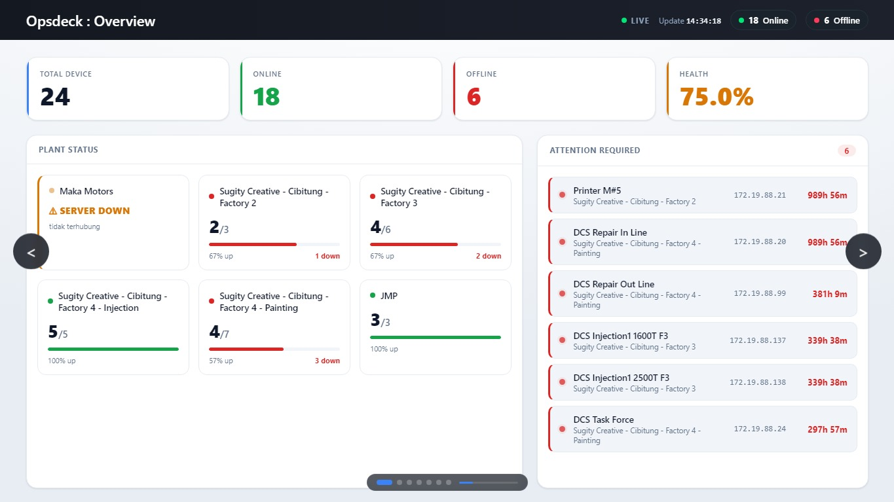

<h1 align="center">Opsdeck</h1>
<p align="center"><em>Watch and reach every machine from one deck.</em></p>

<p align="center">
  
  
  
  
</p>

Opsdeck is a desktop console that **monitors the status of your hardware** and lets you
**remote into any machine over SSH & VNC** — watch and control, all from one place ("the deck").
Built for factory-floor / edge fleets (DCS, IPC, IoT nodes, printers, …), but the data source is swappable to any network.



## Features

- **📊 Monitoring** — every device rendered as a live UP/DOWN dot on a floor-plan; a monitor server pings each host every 3s and broadcasts status over WebSocket. Multi-plant with auto-slide and an aggregate Overview page.
- **⌨️ Remote SSH** — interactive terminal embedded in the app (xterm.js), with copy/paste. No external client.
- **🖥️ Remote VNC** — click a machine → its desktop appears inside the app (noVNC), tunneled over SSH. Supports headless (SSH-only) and external-viewer (e.g. RealVNC) machines too.

## How it works

```
[ Devices ]  ◄── ping every 3s ──  [ Monitor server (Node + WebSocket) ]
                                              │  broadcast UP/DOWN
                                              ▼
                                     [ Opsdeck (Electron) ]
                                     floor-plan + status dots
                                     click a machine → SSH / VNC (over SSH tunnel)
```

## Installation

**From a release:** download the installer for your OS and run it (Windows → `Opsdeck-Setup-<version>.exe`).

**From source:**
```bash
cd app
npm install
npm start                 # run the app
npm run dist:win          # build a Windows installer (needs Wine on Linux)
```

## Usage

1. Start the monitor server on your network (`serverside/`).
2. Launch Opsdeck. It checks the network gate, then shows the floor-plan; pages auto-slide between plants.
3. Click a machine → a detail modal opens → **VNC** or **SSH Terminal**.
4. Manage per-machine credentials from the header menu → **Kelola Remote**, or edit `app/remotes.json`.

## Configuration (swap the data source)

Opsdeck ships pointed at one network; repoint it by editing three places:

| What | Where |
|---|---|
| Monitored hosts (ping list) | `serverside/` — the `devices` list |
| Plants & device boxes | `app/index.html` — each `<section class="page" data-server="IP" data-port="PORT">` is a plant; each `.machine-box` `id` = device name sanitized (`[^a-zA-Z0-9]`→`_`). Box positions are drag-editable via **Edit Layout** (saved to `layout.json`). |
| Remote hosts & credentials | `app/remotes.json` (gitignored) or the in-app **Kelola Remote** UI |
| Network / VPN gate | `app/vpn-check.js` — subnets & reachability probes |

## Project structure

| Path | Contents |
|---|---|
| `app/` | The Opsdeck desktop app (Electron) — [internals README](app/README.md) |
| `serverside/` | Monitor server (Node WebSocket ping monitor) |
| `shared/` | Cross-process flag files |
| `legacy/` | Earlier monitoring-only version (kept for reference) |

## Tech Stack

Electron · noVNC · xterm.js · ssh2 · ws · Node.js

## License

[MIT](LICENSE) © Rifky Andigta Al-Fathir

---

<sub>Originally built for hardware ops at Stechoq.</sub>
